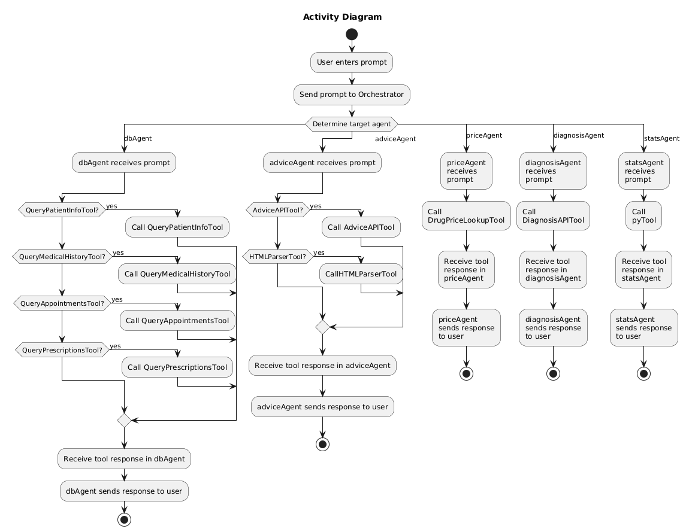

# To Run Docs:
In this project's root directory, run these commands:
`python -m venv autogen`
`source autogen/bin/activate`
`pip install -r ai/requirements.txt`

Use this kernel for the jupyter notebook and install any required packages when prompted.
Then download the model by running `ollama pull qwen2.5:14b`.

After those steps, the documentation can be run.

# The Underlying Agentic AI System of DocTalk

